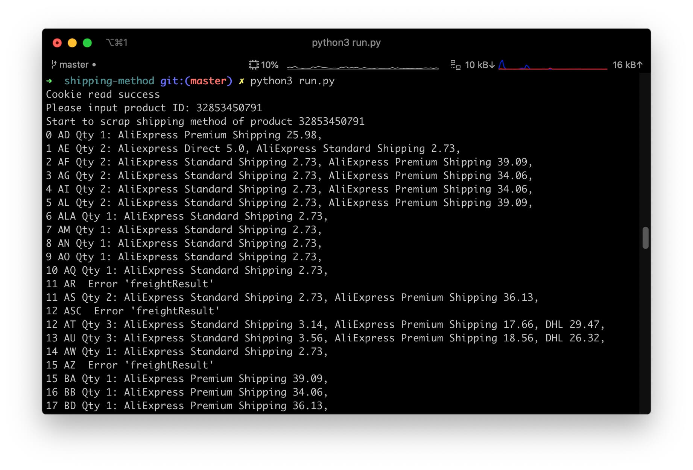

# Shipping Method
A batch of Python scripts on AliExpress platform.

## Require
- Python 3.2+
- Model: requests, json, time, sys, xlwt
- Product ID on Aliexpress

## How to use

1. Save cookie to cookie.txt file.
2. Execute run.py or run.bat.
3. All data scraped will be saved to the xls file.

### Screenshot

